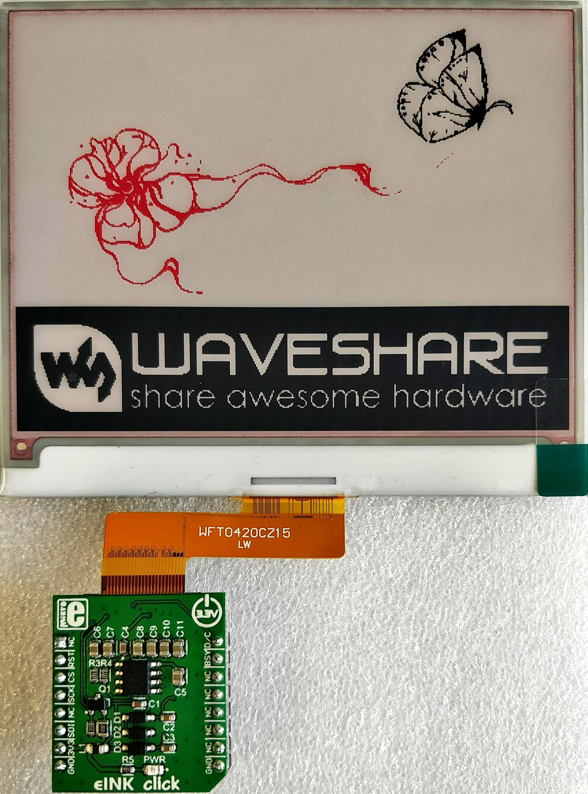

# e-Paper Display
> 4.2inch E-Ink raw display, 400x300, three-color

## Documentation
[User Manual](https://www.waveshare.com/w/upload/2/20/4.2inch-e-paper-module-b-user-manual-en.pdf)

[Datasheet](https://www.waveshare.com/w/upload/7/7f/4.2inch-e-paper-b-specification.pdf)

## Schematic

[Source](https://www.waveshare.com/w/upload/9/97/4.2inch_e-Paper_Schematic.pdf)

## Font creation
[Source](https://wavesharejfs.blogspot.com/2018/08/make-new-larger-font-for-waveshare-spi.html)

